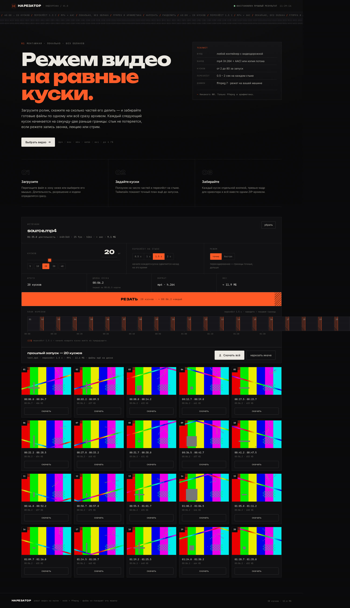

# НАРЕЗАТОР



Режет видео на равные куски. Загрузил ролик — сказал сколько частей нужно —
получил готовые файлы: каждый отдельно и всё сразу ZIP-ом.
На стыках есть перехлёст: каждый следующий кусок начинается на 0.5–2 секунды
раньше границы, то есть содержит кусочек предыдущего.

Node + Express + ffmpeg (статический билд, ставить ничего не надо).

## Запуск

```bash
git clone https://github.com/DimaCharon/obrizan.git
cd obrizan
./start.sh      # http://localhost:4173
```

`./start.sh` сам поставит зависимости, если их нет, и поднимет сервер заново,
если процесс упадёт. Если он почему-то не нужен — `npm install && npm start`.

Другие порты: `PORT=8080 npm start`.
Лимит загрузки по умолчанию 4 ГБ: `MAX_UPLOAD_BYTES=8589934592 npm start`.

## Как пользоваться

1. Перетащить видео в зону (или нажать и выбрать файл).
   Длительность, разрешение, fps и кодеки определятся сразу.
2. Задать **кусков** (2–80, ползунок / цифры / быстрые чипы).
3. Задать **перехлёст** на стыке: 0.5 / 1 / 1.5 / 2 секунды.
4. Выбрать режим:
   * **точно** — перекодирование (H.264 + AAC), границы точные, дольше;
   * **быстро** — копия потока без перекодирования, мгновенно,
     границы попадают в ближайший ключевой кадр.
5. Нажать **резать**. Таймлайн показывает, какой кусок сейчас пишется.
6. Забрать: кнопка «скачать» на каждой карточке, превью-кадр для ориентира,
   клик по карточке — посмотреть кусок прямо в браузере,
   «Скачать всё» — один ZIP.

## Как считается план

При длительности `D`, числе кусков `N` и перехлёсте `O`:

```
длина секции      = D / N
кусок №1          = [0,            D/N]
кусок №k (k ≥ 2)  = [k·D/N − O,    k·D/N]
```

То есть каждый кусок после первого длиннее ровно на `O` секунд — это и есть
накладка на предыдущий кусок. Последний кусок заканчивается ровно на `D`.
Если `D/N < 1.5` секунды, сайт не начнёт резку и попросит уменьшить число кусков.

Имя файла куска кодирует его границы: `cut-07_01m09s-01m23s.mp4`.

## Структура

```
app/
  server.js        API, очередь задач, нарезка через ffmpeg, ZIP
  public/
    index.html     разметка
    styles.css     оформление (тёмная «монтажная», зерно плёнки, hairline-линии)
    app.js         загрузка, таймлайн, прогресс, результаты, превью
  data/            рантайм: uploads/ и jobs/ (создаётся сам, чистится через 24 ч)
  test-api.js      прогон API: план → резка → длительности → zip → валидация
```

## API

| метод | путь | назначение |
|---|---|---|
| `POST` | `/api/uploads` | загрузка исходника одним запросом (multipart, поле `video`) → мета + `fileId` |
| `POST` | `/api/upload-chunk` | загрузка кусками: заголовки `x-upload-id`, `x-attempt`, `x-file-name`, `x-file-size`, `x-chunk-index`, `x-chunk-total`, `x-chunk-offset`, `x-chunk-len`, тело — сырые байты. Порядок и параллельность любые |
| `POST` | `/api/upload-finish` | `{uploadId, name, size, total, attempt}` → проверяет, что долели все куски, собирает файл и отвечает метой исходника |
| `POST` | `/api/plan` | `{fileId, pieces, overlap}` → план нарезки (для таймлайна) |
| `POST` | `/api/cut` | `{fileId, pieces, overlap, mode}` → `{jobId, job}` |
| `GET` | `/api/jobs/:id` | статус задачи, прогресс, список кусков |
| `GET` | `/api/jobs` | последние задачи — страница после перезагрузки поднимает результат |
| `GET` | `/api/download/:jobId/:index` | один кусок (`Content-Disposition: attachment`) |
| `GET` | `/api/jobs/:jobId/zip` | все куски одним архивом |
| `DELETE` | `/api/jobs/:id` · `/api/uploads/:fileId` | убрать с диска |
| `GET` | `/media/...` | раздача кусков и превью-кадров |

Задачи выполняются по очереди, одна за раз; прогресс считается по `time=` из
stderr ffmpeg, для каждого куска дополнительно вырезается превью-кадр.

## Загрузка крупных файлов

Файлы больше 8 МБ уходят не одним телом, а кусками по 4 МБ (3 потока), каждый
кусок пишется в файл по своему байтовому смещению. Когда все куски на диске,
клиент вызывает `/api/upload-finish` — только тогда сервер собирает файл
и читает мету. Отдельная финализация нужна потому, что последний кусок обычно
самый маленький и при параллельной загрузке приезжает первым: раньше сервер
в этот момент видел недокачанный файл и отвечал 415.

Каждая попытка помечается токеном `x-attempt`. Если прокси режет тело запроса
(`413 Payload Too Large`), клиент уменьшает кусок вдвое —
4 МБ → 2 МБ → 1 МБ → 512 КБ → 256 КБ → 128 КБ — и начинает попытку заново
с новым токеном; сервер по токену понимает, что это новый заход, и не путает
учёт кусков. Проверено на прокси с лимитом 512 КБ: видео на 9.5 МБ с кириллицей
в имени загрузилось 19 кусками по 512 КБ и нарезалось штатно.

Имя файла в заголовке кодируется через `encodeURIComponent` — заголовки XHR
должны быть в ISO-8859-1, кириллица в них иначе роняет запрос.

Если даже 128 КБ не проходят, сайт честно скажет, что тело режет прокси,
и посоветует открыть его локально.

## Ограничения

* До 80 кусков за запуск, кусок короче 1.5 с не делается.
* В «точном» режиме всегда перекодирование — для часового видео это минуты.
* В «быстром» режиме, если копирование потока в MP4 невозможно,
  кусок автоматически перекодируется (в карточке будет пометка).
* Файлы лежат на той машине, где запущен сервер; наружу ничего не уходит.

## Запуск

```bash
./start.sh          # доставит зависимости, если их нет, и поднимет сервер
PORT=8080 ./start.sh
```

`start.sh` не просто запускает: если процесс упадёт, скрипт поднимет его заново,
а если окружение потеряло `node_modules` — поставит их. Повторный запуск, когда
сайт уже работает, ничего не сломает.

Исходники и задачи лежат в `data/` **только в оперативной процесса и на диске
ряда** — это временное хранилище. Если весь контейнер выключили, диск теряется
вместе с ним, и загрузку приходится повторять. При перезапуске одного процесса
`start.sh` всё восстанавливает само: исходник и результат прошлой нарезки
вернутся на место.

Если сайт открыт через чужой прокси превью, а тот оставляет вас с ошибкой 404
на обрезке — значит прокси перезапустил контейнер и стёр временные файлы.
Запустите локально: `cd obrizan && ./start.sh`.

## Проверка

```bash
npm test                      # API: план, нарезка, превью, zip, валидация, чанки
python3 test-ui-full.py       # браузер: весь путь от загрузки до архива
python3 test-proxy.py         # тот же путь через прокси, который режет тело запроса
python3 test-40min.py         # браузер: видео на 40 минут, 80 кусков, архив
python3 test-timeout.py       # браузер: таймауты и понятные тексты ошибок
node proxy-sim.js 4174 4173 524288 reset   # имитатор такого прокси (reset|json|strip)
```

`test-proxy.py` и `proxy-sim.js` проверяют главное: сайт должен работать не только
локально, но и через чужой прокси превью, который режет тело запроса. Клиент в этом
случае сам уменьшает куски до проходного размера, а метаданные чанка дублируются
в query — на случай, если прокси срезает нестандартные `x-` заголовки.

`test-40min.py` прогоняет через сайт сорокаминутное видео (149 МБ, кириллица в имени):
загрузку, 80 кусков по 31.5 с с перехлёстом, все превью, архив на 198 МБ и повторный
прогон в два куска по 20 минут. Через прокси с лимитом 512 КБ загрузка занимает 3.4 с
вместо 1.4 с — то есть куски реально проходят, а не молчат.

`test-timeout.py` проверяет, что подвешенный запрос не молчит вечески: если прокси
принял тело и не отвечает, `fetchJson` роняет запрос по таймауту, а загрузка целым
файлом, у которой не пошёл ни первый байт, через 45 с уходит на куски вместо того,
чтобы крутить крутилку четыре минуты. Там же проверяется, что 404 от опроса задачи
даёт текст «сервер перезапустился и потерял временные файлы», а не сырое
«сервер ответил 404».
